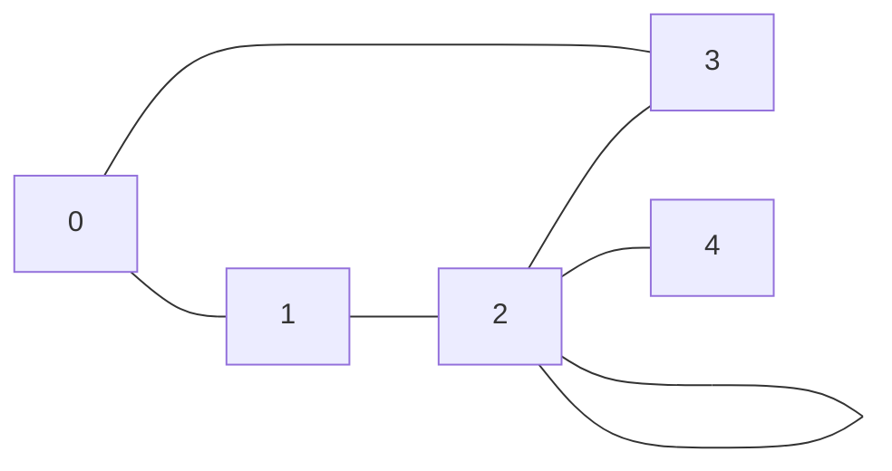

## Objectifs

1. Apprendre à **représenter les graphes** en programmation
2. Apprendre à **coder des algorithmes** de recherche avec et sans heuristiques
3. Apprendre à **générer des graphes** aléatoires
4. Apprendre à **générer des statistiques** sur les algorithmes de recherche
5. À terme, apprendre à coder des **interfaces graphiques** pour visualiser les algorithmes

## Représentations d'un graphe

- Un graphe est une structure de données composée de sommets (ou noeuds) et d'arêtes.
- Les sommets sont les points du graphe et les arêtes sont les liens entre les sommets.
- Un graphe peut être orienté ou non orienté.
- Un graphe est orienté si les arêtes ont un sens, sinon il est non orienté.
- Il existe plusieurs façons de représenter un graphe en mémoire, parmi lesquelles :
  - Matrice d'adjacence
  - Liste d'adjacence ou Table de hachage
  - Objets

### Matrice d'adjacence

Une matrice d'adjacence est une matrice carrée de taille `n x n` où `n` est le nombre de sommets du graphe.
_ Si le sommet `i` est relié au sommet `j`, alors `matrice[i][j] = 1`
_ sinon `matrice[i][j] = 0`.

Soit le graphe non orienté suivant:



Et sa représentation par une matrice d'adjacence :

```
N   0 1 2 3 4
    ---------
0 | 0 1 0 1 0
1 | 1 0 1 0 0
2 | 0 1 0 1 1
3 | 1 0 1 0 0
4 | 0 0 1 0 0
```

- `N` : Noeuds (sommets) 0, 1, 2, 3 et 4
- 0 = non relié
- 1 = relié
- Dans cet exemple, le sommet 0 est relié aux sommets 1 et 3, le sommet 1 est relié aux sommets 0 et 2, etc.
- En programmation, on peut utiliser un tableau à deux dimensions pour représenter la matrice d'adjacence, puis itérer sur les éléments pour trouver les voisins de chaque sommet.

### Liste d'adjacence ou table de hachage

Une liste d'adjacence est une liste de listes où chaque sommet est associé à une liste de ses voisins.

Soit le graphe non orienté suivant:


Et sa représentation par une liste d'adjacence :

```
0: [1, 3]
1: [0, 2]
2: [1, 2, 3, 4]
3: [0, 2]
4: [2]
```

- `0: [1, 3]` : Le sommet 0 est relié aux sommets 1 et 3
- `1: [0, 2]` : Le sommet 1 est relié aux sommets 0 et 2
- `2: [1, 2, 3, 4]` : Le sommet 2 est relié aux sommets 1, 2, 3 et 4
- `3: [0, 2]` : Le sommet 3 est relié aux sommets 0 et 2
- `4: [2]` : Le sommet 4 est relié au sommet 2
- En programmation, on peut utiliser un tableau de listes pour représenter la liste d'adjacence, puis itérer sur les éléments pour trouver les voisins de chaque sommet.

### Objets

- Une autre façon de représenter un graphe en mémoire est d'utiliser des objets.
    - Chaque **sommet** est un objet qui contient une **liste de ses voisins**.
    - Chaque **voisin** est un objet qui contient une référence vers le sommet voisin.
    - Chaque **arête** est un objet qui contient une référence vers les deux sommets reliés.
    - Un graphe est un objet qui contient une liste de ses sommets.

- En programmation orientée objet, on peut définir des classes `Sommet` et `Graphe` pour représenter les sommets et le graphe :
    - Classe `Sommet` (ou `Node`) : Objet représentant un sommet (noeud) du graphe
        - `id` : Identifiant du sommet
        - `voisins` : Liste des sommets voisins
        - `parent` : Optionnel. Sommet parent, utile pour les algorithmes de recherche
    - Classe `Graphe` : Objet représentant le graphe
        - `sommets` : Liste des sommets du graphe
- On pourra définir des méthodes :
    - pour ajouter des sommets, ajouter des arêtes, etc.
    - pour les algorithmes de recherche (BFS, DFS, A\*, Dijkstra, etc.).
    - pour générer des graphes aléatoires, des statistiques, des représentation graphiques, etc.
- Et enfin faire usage de l'héritage pour crééer des classes :
    - plus spécifiques (graphe orienté, graphe non orienté, graphe pondéré, etc.)
    - qui produisent des interfaces graphiques
    - qui utilisent des bases de données, etc.

- Cette représentation est plus flexible et plus naturelle que les deux précédentes.
- Elle permet de stocker des informations supplémentaires sur les sommets, les arêtes, etc.

#### Exemple

Voici un exemple de graphe non orienté :


Et voici sa représentation par des objets :

import { Tabs, TabItem } from "@astrojs/starlight/components";
import { Code } from "@astrojs/starlight/components";
import grapheTS from "/src/content/docs/programmes/tp01/typescript/graphe.ts?raw";
import grapheJavaSommet from "/src/content/docs/programmes/tp01/java/src/Sommet.java?raw";
import grapheJavaGraphe from "/src/content/docs/programmes/tp01/java/src/Graphe.java?raw";
import grapheJavaMain from "/src/content/docs/programmes/tp01/java/src/Main.java?raw";

<Tabs>

    <TabItem label="Typescript">

        <Code code={grapheTS} lang="ts" title="graphe.ts" />

        Résultat :

        ```
        0: [1, 3]
        1: [0, 2]
        2: [1, 2, 3, 4]
        3: [0, 2]
        4: [2]
        ```
    </TabItem>

    <TabItem label="Java">

        <Code code={grapheJavaSommet} lang="java" title="Sommet.java" />
        <Code code={grapheJavaGraphe} lang="java" title="Graphe.java" />
        <Code code={grapheJavaMain} lang="java" title="Main.java" />

        Résultat :

        ```
        Sommet 1 : 2 3 
        Sommet 2 : 1 2 3 4 
        Sommet 3 : 1 2 4 
        Sommet 4 : 2 3 5 
        Sommet 5 : 4 
        ```
    </TabItem>

    <TabItem label="Python">
        ```python
        class Sommet:
            def __init__(self, id):
                self.id = id
                self.voisins = []

        class Graphe:
            def __init__(self):
                self.sommets = []
        ```
    </TabItem>

    <TabItem label="JavaScript">
        ```javascript
        class Sommet {
            constructor(id) {
                this.id = id;
                this.voisins = [];
            }
        }

        class Graphe {
            constructor() {
                this.sommets = [];
            }
        }
        ```
    </TabItem>

</Tabs>

## Algorithme de recherche

- Un algorithme de recherche permet de trouver un chemin entre deux sommets d'un graphe.
- Il existe plusieurs algorithmes de recherche, parmi lesquels :
  - Recherche en largeur (BFS)
  - Recherche en profondeur (DFS)
  - Recherche A\*
  - Recherche Dijkstra
  - Recherche Bellman-Ford
  - Recherche Floyd-Warshall
  - Recherche de chemin critique
  - etc.

## Génération de graphes aléatoires

- Il est possible de générer des graphes aléatoires pour tester les algorithmes de recherche.
- Il existe plusieurs modèles de génération de graphes aléatoires, parmi lesquels :
  - Modèle Erdös-Rényi
  - Modèle Barabási-Albert
  - Modèle Watts-Strogatz
  - Modèle de graphe aléatoire uniforme
  - etc.

## Génération de statistiques

- Il est possible de générer des statistiques sur les algorithmes de recherche pour comparer leur efficacité.
- Les statistiques peuvent porter sur :
  - Le temps d'exécution
  - Le nombre de sommets visités
  - Le nombre d'arêtes visitées
  - La longueur du chemin trouvé
  - etc.

## Interfaces graphiques

- Il est possible de coder des interfaces graphiques pour visualiser les algorithmes de recherche.
- Les interfaces graphiques permettent de voir le graphe, les sommets visités, les arêtes visitées, le chemin trouvé, etc.
- Les interfaces graphiques peuvent être codées en Java, Python, JavaScript, etc.

## Conclusion

- La programmation d'algorithmes de recherche sur les graphes est un domaine très vaste et très riche.
- Il permet de travailler sur des problèmes concrets et de mettre en oeuvre des algorithmes très variés.
- Il permet également de travailler sur des problèmes de complexité algorithmique et de performance.
- C'est un domaine très intéressant pour les étudiants en informatique et pour les développeurs en général.

## Références

- [Wikipedia \* Graph theory](https://en.wikipedia.org/wiki/Graph_theory)
- [Wikipedia \* Graph algorithms](https://en.wikipedia.org/wiki/Graph_algorithm)
- [Wikipedia \* Graph drawing](https://en.wikipedia.org/wiki/Graph_drawing)
- [Wikipedia \* Graph database](https://en.wikipedia.org/wiki/Graph_database)
- [Wikipedia \* Graph visualization](https://en.wikipedia.org/wiki/Graph_visualization)
- [Wikipedia \* Graph drawing software](https://en.wikipedia.org/wiki/Graph_drawing_software)
- [Wikipedia \* Graph theory software](https://en.wikipedia.org/wiki/Graph_theory_software)
- [Wikipedia \* Graph theory book](https://en.wikipedia.org/wiki/Graph_theory_book)
- [Wikipedia \* Graph theory journal](https://en.wikipedia.org/wiki/Graph_theory_journal)
- [Wikipedia \* Graph theory conference](https://en.wikipedia.org/wiki/Graph_theory_conference)
- [Wikipedia \* Graph theory course](https://en.wikipedia.org/wiki/Graph_theory_course)
- [Wikipedia \* Graph theory lecture](https://en.wikipedia.org/wiki/Graph_theory_lecture)
- [Wikipedia \* Graph theory tutorial](https://en.wikipedia.org/wiki/Graph_theory_tutorial)
- [Wikipedia \* Graph theory video](https://en.wikipedia.org/wiki/Graph_theory_video)
- [Wikipedia \* Graph theory code](https://en.wikipedia.org/wiki/Graph_theory_code)
- [Wikipedia \* Graph theory project](https://en.wikipedia.org/wiki/Graph_theory_project)
- [Wikipedia \* Graph theory challenge](https://en.wikipedia.org/wiki/Graph_theory_challenge)
- [Wikipedia \* Graph theory competition](https://en.wikipedia.org/wiki/Graph_theory_competition)
- [Wikipedia \* Graph theory game](https://en.wikipedia.org/wiki/Graph_theory_game)
- [Wikipedia \* Graph theory puzzle](https://en.wikipedia.org/wiki/Graph_theory_puzzle)
- [Wikipedia \* Graph theory quiz](https://en.wikipedia.org/wiki/Graph_theory_quiz)
- [Wikipedia \* Graph theory test](https://en.wikipedia.org/wiki/Graph_theory_test)
- [Wikipedia \* Graph theory exam](https://en.wikipedia.org/wiki/Graph_theory_exam)
- [Wikipedia \* Graph theory certification](https://en.wikipedia.org/wiki/Graph_theory_certification)
- [Wikipedia \* Graph theory degree](https://en.wikipedia.org/wiki/Graph_theory_degree)
- [Wikipedia \* Graph theory diploma](https://en.wikipedia.org/wiki/Graph_theory_diploma)
- [Wikipedia \* Graph theory job](https://en.wikipedia.org/wiki/Graph_theory_job)
- [Wikipedia \* Graph theory salary](https://en.wikipedia.org/wiki/Graph_theory_salary)
- [Wikipedia \* Graph theory company](https://en.wikipedia.org/wiki/Graph_theory_company)
- [Wikipedia \* Graph theory industry](https://en.wikipedia.org/wiki/Graph_theory_industry)
- [Wikipedia \* Graph theory market](https://en.wikipedia.org/wiki/Graph_theory_market)
- [Wikipedia \* Graph theory economy](https://en.wikipedia.org/wiki/Graph_theory_economy)
- [Wikipedia \* Graph theory business](https://en.wikipedia.org/wiki/Graph_theory_business)
- [Wikipedia \* Graph theory startup](https://en.wikipedia.org/wiki/Graph_theory_startup)
- [Wikipedia \* Graph theory entrepreneur](https://en.wikipedia.org/wiki/Graph_theory_entrepreneur)
- [Wikipedia \* Graph theory venture](https://en.wikipedia.org/wiki/Graph_theory_venture)
- [Wikipedia \* Graph theory investment](https://en.wikipedia.org/wiki/Graph_theory_investment)

```

```
