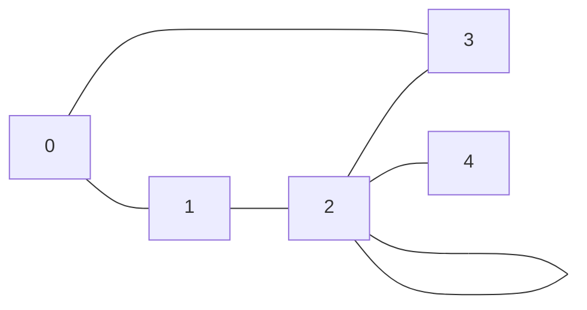

## Objectifs

1. Apprendre à **représenter les graphes** en programmation
2. Apprendre à **coder des algorithmes** de recherche sur les graphes
3. Apprendre à **générer des graphes** aléatoires
4. Apprendre à **générer des statistiques** sur les algorithmes de recherche
5. À terme, apprendre à coder des **interfaces graphiques** pour visualiser les algorithmes

## Représentations d'un graphe

- Un **graphe** est une **structure de données** composée de **sommets** (ou noeuds) et d'**arêtes**.
- En anglais :
    - Un `graphe` se dit _graph_
    - Un `sommet` ou `noeud` est appelé un _vertex_ ou une _node_
        - Le pluriel de _vertex_ est _vertices_
    - Une `arête` est appelée une _edge_
- Les **sommets** sont les **points** du graphe et les **arêtes** sont les **liens** entre les sommets.
- Un graphe peut être **orienté** ou non **orienté**.
    - Un graphe est orienté si les arêtes ont un sens, sinon il est non orienté.
- Il existe plusieurs façons de représenter un graphe avec un ordinateur, parmli lesquelles :
  - Avec une matrice d'adjacence
  - Avec une liste d'adjacence (ou Table de hachage)
  - Avec des Objets

### Matrice d'adjacence

Une matrice d'adjacence est une matrice carrée, de taille `n x n` où `n` est le nombre de sommets du graphe.
- Si le sommet `i` est relié au sommet `j`, alors `matrice[i][j] = 1`
- sinon `matrice[i][j] = 0`.

Soit le graphe non orienté suivant:



Et sa représentation par une matrice d'adjacence :

```
N   0 1 2 3 4
    ---------
0 | 0 1 0 1 0
1 | 1 0 1 0 0
2 | 0 1 2 1 1
3 | 1 0 1 0 0
4 | 0 0 1 0 0
```

- `N` : Noeuds (sommets) 0, 1, 2, 3 et 4
- 0 = non relié
- 1 = relié
- Dans cet exemple, le sommet 0 est relié aux sommets 1 et 3, le sommet 1 est relié aux sommets 0 et 2, etc.
- La matrice est symétrique pour un graphe non orienté.

En programmation, on peut utiliser un tableau à deux dimensions pour représenter la matrice d'adjacence, puis itérer sur les éléments pour trouver les voisins de chaque sommet.

### Liste d'adjacence ou table de hachage

Une liste d'adjacence est une liste de listes où chaque sommet est associé à une liste de ses voisins.

Soit le graphe non orienté suivant:


Et sa représentation par une liste d'adjacence :

```
0: [1, 3]
1: [0, 2]
2: [1, 2, 3, 4]
3: [0, 2]
4: [2]
```

- `0: [1, 3]` : Le sommet 0 est relié aux sommets 1 et 3
- `1: [0, 2]` : Le sommet 1 est relié aux sommets 0 et 2
- `2: [1, 2, 3, 4]` : Le sommet 2 est relié aux sommets 1, 2, 3 et 4
- `3: [0, 2]` : Le sommet 3 est relié aux sommets 0 et 2
- `4: [2]` : Le sommet 4 est relié au sommet 2

En programmation, on peut utiliser un tableau de listes pour représenter la liste d'adjacence, puis itérer sur les éléments pour trouver les voisins de chaque sommet.

### Objets

Pour représenter un graphe avec des objets, on peut utiliser une approche orientée objet :

- Chaque **sommet** est un objet qui contient une **liste de ses voisins**, et éventuellement un **parent** si le graphe est orienté
- Chaque **voisin** est un objet qui contient une référence vers le sommet voisin.
- Chaque **arête** est un objet qui contient une référence vers les deux sommets reliés.
- Un **graphe** est un objet qui contient une liste de ses sommets.

#### Les classes, attributs et méthodes

On peut définir des classes `Sommet` et `Graphe` pour représenter les sommets et le graphe :
- Classe `Sommet` (ou `Node`) : Objet représentant un sommet (noeud) du graphe. 
- Attributs de `Sommet` :
    - `id` : Identifiant du sommet
    - `voisins` : Liste des sommets voisins
    - `parent` : Optionnel. Sommet parent, utile pour les algorithmes de recherche
- Classe `Graphe` : Objet représentant le graphe.
- Attributs de `Graphe` :
    - `sommets` : Liste des sommets du graphe

On pourra définir des méthodes :
- pour ajouter des sommets, ajouter des arêtes, etc.
- pour les algorithmes de recherche (BFS, DFS, A\*, Dijkstra, etc.).
- pour générer des graphes aléatoires, des statistiques, des représentation graphiques, etc.

Et enfin faire usage de l'héritage pour crééer des classes :
- plus spécifiques (graphe orienté, graphe non orienté, graphe pondéré, etc.)
- qui produisent des interfaces graphiques
- qui utilisent des bases de données, etc.

> Cette représentation est plus flexible et plus naturelle que les deux précédentes.
> Elle permet de stocker des informations supplémentaires sur les sommets, les arêtes, etc.

#### Exemple

Voici un exemple de graphe non orienté :


Et voici sa représentation par des objets :

import { Tabs, TabItem } from "@astrojs/starlight/components";
import { Code } from "@astrojs/starlight/components";
import grapheTS from "/src/content/docs/programmes/tp01/typescript/graphe.ts?raw";
import grapheJavaSommet from "/src/content/docs/programmes/tp01/java/src/Sommet.java?raw";
import grapheJavaGraphe from "/src/content/docs/programmes/tp01/java/src/Graphe.java?raw";
import grapheJavaMain from "/src/content/docs/programmes/tp01/java/src/Main.java?raw";
import graphePython from "/src/content/docs/programmes/tp01/python/graphe.py?raw";
import grapheJS from "/src/content/docs/programmes/tp01/javascript/graphe.js?raw";

<Tabs>

    <TabItem label="Typescript">

        <Code code={grapheTS} lang="ts" title="graphe.ts" />

    </TabItem>

    <TabItem label="Java">

        <Code code={grapheJavaSommet} lang="java" title="Sommet.java" />
        <Code code={grapheJavaGraphe} lang="java" title="Graphe.java" />
        <Code code={grapheJavaMain} lang="java" title="Main.java" />

    </TabItem>

    <TabItem label="Python">

        <Code code={graphePython} lang="python" title="graphe.py" />

    </TabItem>

    <TabItem label="JavaScript">
    
        <Code code={grapheJS} lang="js" title="graphe.js" />

    </TabItem>

</Tabs>

## Algorithme de recherche

- Un algorithme de recherche permet de trouver un chemin entre deux sommets d'un graphe.
- Il existe plusieurs algorithmes de recherche, parmi lesquels :
  - Recherche en largeur (BFS)
  - Recherche en profondeur (DFS)
  - Recherche A\*
  - Recherche Dijkstra
  - Recherche Bellman-Ford
  - Recherche Floyd-Warshall
  - Recherche de chemin critique
  - etc.

## Génération de graphes aléatoires

- Il est possible de générer des graphes aléatoires pour tester les algorithmes de recherche.
- Il existe plusieurs modèles de génération de graphes aléatoires, parmi lesquels :
  - Modèle Erdös-Rényi
  - Modèle Barabási-Albert
  - Modèle Watts-Strogatz
  - Modèle de graphe aléatoire uniforme
  - etc.

Il est aussi possible de générer des matrices d'adjacence aléatoires, puis de les convertir en liste d'adjacence ou en objets.

## Génération de statistiques

- Il est possible de générer des statistiques sur les algorithmes de recherche pour comparer leur efficacité.
- Les statistiques peuvent porter sur :
  - Le temps d'exécution
  - Le nombre de sommets visités
  - Le nombre d'arêtes visitées
  - La longueur du chemin trouvé
  - etc.

## Quelques Ressources

- [Wikipedia \* Théorie des graphes](https://en.wikipedia.org/wiki/Graph_theory)
- [Wikipedia \* Graphes sour formes de grilles](https://en.wikipedia.org/wiki/Lattice_graph) et aussi [cette ressource](https://www.redblobgames.com/pathfinding/grids/graphs.html)
- [Algorithmes de recherche](https://towardsdatascience.com/ai-search-algorithms-every-data-scientist-should-know-ed0968a43a7a)