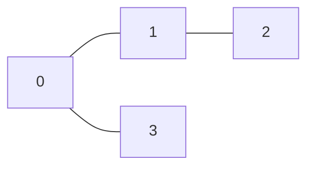
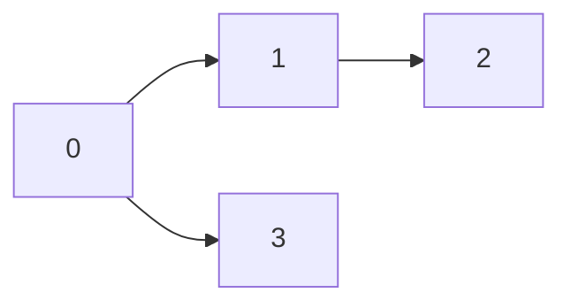
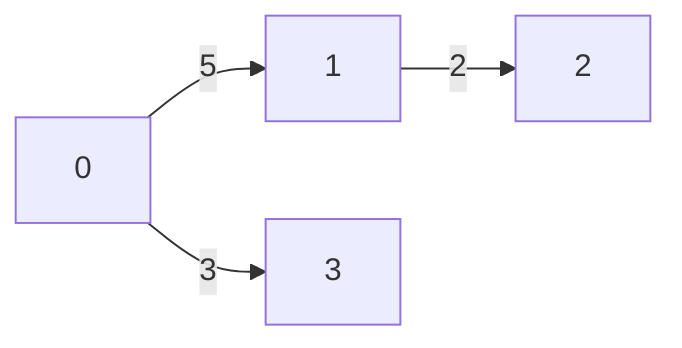
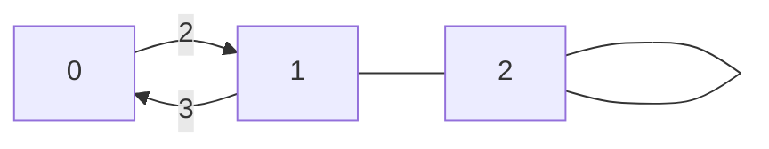

import Slide from '/src/components/Slide.astro';

<Slide title="TP Programmation de graphes">

## Objectifs

1. Apprendre à **représenter les graphes** en programmation
2. Apprendre à **coder des algorithmes** de recherche sur les graphes
3. Apprendre à **générer des graphes** aléatoires
4. Apprendre à **générer des statistiques** sur les algorithmes de recherche
5. À terme, apprendre à coder des **interfaces graphiques** pour visualiser les algorithmes

</Slide>
<Slide>

## Les graphes

* Un **graphe** est une **structure de données** composée de **sommets** (ou noeuds) et d'**arêtes**.

* En **anglais** :
    * Un `graphe` se dit _graph_
    * Un `sommet` ou `noeud` est appelé un _vertex_ ou une _node_
        * Le pluriel de _vertex_ est _vertices_
    * Une `arête` est appelée une _edge_
* Les **sommets** sont les **points** du graphe et les **arêtes** sont les **liens** entre les sommets.

</Slide>
<Slide>

### Orientés et non orientés

Un graphe peut être **orienté** ou non **orienté**.

Un graphe est orienté si les arêtes ont un sens, sinon il est non orienté :

_Exemple de graphe non orienté_

 

_Exemple de graphe orienté_

</Slide>
<Slide>

### Pondérés et non pondérés

Un graphe peut être **pondéré** ou **non pondéré**.

Un graphe est pondéré si les arêtes ont un poids, sinon il est non pondéré :

_Exemple de graphe non pondéré_

 

_Exemple de graphe pondéré_

</Slide>
<Slide>

### Complexes et non complexes

Un graphe peut être **simple** ou **complexe**.

Un graphe est simple s'il n'a pas de boucles ni d'arêtes multiples, sinon il est complexe :

_Exemple de graphe simple_

 

_Exemple de graphe complexe_

</Slide>