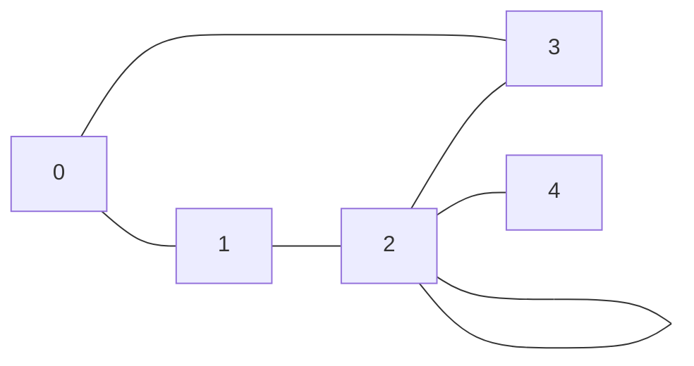
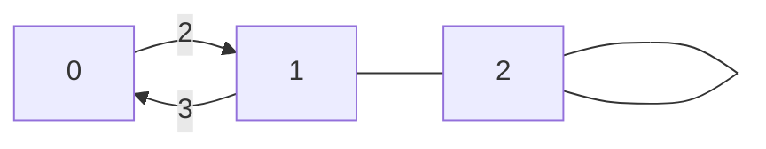

import Slide from '/src/components/Slide.astro';

<Slide title="Représentations des graphes">

Il existe plusieurs façons de représenter un graphe dans un **programme informatique**, parmi lesquelles :

* Les **Matrices d'Adjacence**
* Les **Listes d'Adjacence** (Tables de Hachage)
* Les **Objets**

</Slide>
<Slide>

### Matrices d'adjacence

Une matrice d'adjacence est une matrice carrée, de taille `n x n` où `n` est le nombre de sommets du graphe.
* Si le sommet `i` est relié au sommet `j`, alors `matrice[i][j] = 1`
* sinon `matrice[i][j] = 0`.

</Slide>
<Slide title="Matrices d'adjacence">

#### Graphes simples

Soit le graphe non orienté suivant :



Et sa représentation par une matrice d'adjacence :

```
N   0 1 2 3 4
    ---------
0 | 0 1 0 1 0
1 | 1 0 1 0 0
2 | 0 1 1 1 1
3 | 1 0 1 0 0
4 | 0 0 1 0 0
```

* `N` : Noeuds (sommets) 0, 1, 2, 3 et 4
* 0 = non relié
* 1 = relié
* Dans cet exemple, le sommet 0 est relié aux sommets 1 et 3, le sommet 1 est relié aux sommets 0 et 2, etc.
* La matrice est **symétrique par la diagonale** _pour un graphe non orienté_.

En programmation, on peut utiliser **un tableau à deux dimensions** pour représenter la matrice d'adjacence, puis **itérer sur les éléments** pour trouver les voisins de chaque sommet.

</Slide>
<Slide title="Matrices d'adjacence">

#### Graphes complexes

Soit le graphe orienté, complexe et pondéré suivant :




Et sa représentation par une matrice d'adjacence :

```
N   0 1 2
    -------
0 | 0 2 0
1 | 3 0 0
2 | 0 0 0
```

* `N` : Noeuds (sommets) 0, 1 et 2
* 0 = non relié
* 2 = relié avec un poids de 2
* 3 = relié avec un poids de 3
* Dans cet exemple, le sommet 0 est relié au sommet 1 avec un poids de 2, le sommet 1 est relié au sommet 0 avec un poids de 3, etc.

</Slide>
<Slide>

### Listes d'adjacence ou table de hachage

Une **liste d'adjacence** est une liste de listes où chaque sommet est associé à une liste de ses voisins.

#### Graphes simples

Soit le graphe non orienté suivant :


Et sa représentation par une liste d'adjacence :

```
0: [1, 3]
1: [0, 2]
2: [1, 2, 3, 4]
3: [0, 2]
4: [2]
```

* `0: [1, 3]` : Le sommet 0 est relié aux sommets 1 et 3
* `1: [0, 2]` : Le sommet 1 est relié aux sommets 0 et 2
* `2: [1, 2, 3, 4]` : Le sommet 2 est relié aux sommets 1, 2, 3 et 4
* etc.

En programmation, on peut utiliser un tableau à 2 dimensions pour représenter la liste d'adjacence, puis itérer sur les éléments pour trouver les voisins de chaque sommet.

</Slide>
<Slide title="Listes d'adjacence ou table de hachage">

#### Graphes complexes

Soit le graphe orienté, complexe et pondéré suivant :


Et sa représentation par une liste d'adjacence :

```
0: [(1, 2)]
1: [(0, 3), (2, 0)]
2: [(2, 0)]
```

* `0: [(1, 2)]` : Le sommet 0 est relié au sommet 1 avec un poids de 2
* `1: [(0, 3), (2, 0)]` : Le sommet 1 est relié au sommet 0 avec un poids de 3, et au sommet 2 avec un poids de 0
* `2: [(2, 0)]` : Le sommet 2 est relié à lui-même avec un poids de 0

En programmation, on peut utiliser un tableau de listes (ou un tableau à 3 dimensions) pour représenter la liste d'adjacence, puis itérer sur les éléments pour trouver les voisins de chaque sommet.

</Slide>
<Slide>

### Objets

Pour représenter un graphe avec des objets, on peut utiliser une approche orientée objet :

* Chaque **sommet** (ou noeud, ou `Node`) est un objet qui contient une **liste de ses voisins**, et éventuellement un **parent** si le graphe est orienté
* Chaque **voisin** (ou `neighbor`) est un objet qui contient une référence vers le sommet voisin.
* Chaque **arête** (ou `Edge`) est un objet qui contient une référence vers les deux sommets reliés.
    * Les arêtes peuvent contenir des informations supplémentaires, comme un poids, une couleur, etc.
    * Les arêtes peuvent être stockées dans une liste à part, ou directement dans les sommets.
* Un **graphe** (ou `Graph`) est un objet qui contient une liste de ses sommets.

</Slide>
<Slide>

#### Représentation objet : Classes, attributs et méthodes

On peut définir des classes `Sommet` et `Graphe` pour représenter les sommets et le graphe :
* Classe `Sommet` (ou `Node`) : Objet représentant un sommet (noeud) du graphe. 
    * Attributs possibles :
        * `id` : Identifiant du sommet
        * `voisins` : Liste des sommets voisins
        * `parent` : Optionnel. `Sommet` parent, _utile pour les algorithmes de recherche_
        * `distance` : Optionnel. Distance du sommet à un sommet de référence
        * `poids` : Optionnel. Poids de l'arête entre le sommet et son parent
        * `mur` : Optionnel. Indique si le sommet est un sommet infranchissable
        * etc.
* Classe `Graphe` : Objet représentant le graphe.
    * Attributs possibles :
        * `sommets` : Liste des sommets du graphe

</Slide>
<Slide>

* **Méthodes possibles** :
    * pour ajouter des sommets, ajouter des arêtes, etc.
    * pour les algorithmes de recherche (BFS, DFS, A\*, Dijkstra, etc.).
    * pour générer des graphes aléatoires, des statistiques, des représentation graphiques, etc.

* Usage de l'**héritage** pour crééer des classes :
    * plus spécifiques (graphe orienté, graphe non orienté, graphe pondéré, etc.)
    * qui produisent des interfaces graphiques
    * qui utilisent des bases de données, etc.

:::tip
Cette représentation est plus flexible et plus naturelle que les deux précédentes.

Elle permet de stocker des informations supplémentaires sur les sommets, les arêtes, etc.
:::

</Slide>
<Slide>

#### Exemple de représentation objet

Voici un exemple de graphe non orienté :


Et voici sa représentation par des objets en différents langages de programmation :

import { Tabs, TabItem } from "@astrojs/starlight/components";
import { Code } from "@astrojs/starlight/components";
import grapheTS from "/src/content/docs/programmes/tp01/typescript/graphe.ts?raw";
import grapheJavaSommet from "/src/content/docs/programmes/tp01/java/src/Sommet.java?raw";
import grapheJavaGraphe from "/src/content/docs/programmes/tp01/java/src/Graphe.java?raw";
import grapheJavaMain from "/src/content/docs/programmes/tp01/java/src/Main.java?raw";
import graphePython from "/src/content/docs/programmes/tp01/python/graphe.py?raw";
import grapheJS from "/src/content/docs/programmes/tp01/javascript/graphe.js?raw";
import graphePHP from "/src/content/docs/programmes/tp01/php/graphe.php?raw";

<Tabs>

    <TabItem label="Typescript">

        <Code code={grapheTS} lang="ts" title="graphe.ts" />

    </TabItem>

    <TabItem label="Java">

        <Code code={grapheJavaSommet} lang="java" title="Sommet.java" />
        <Code code={grapheJavaGraphe} lang="java" title="Graphe.java" />
        <Code code={grapheJavaMain} lang="java" title="Main.java" />

    </TabItem>

    <TabItem label="Python">

        <Code code={graphePython} lang="python" title="graphe.py" />

    </TabItem>

    <TabItem label="JavaScript">
    
        <Code code={grapheJS} lang="js" title="graphe.js" />

    </TabItem>

    <TabItem label="PHP">
    
        <Code code={graphePHP} lang="php" title="graphe.php" />

    </TabItem>

</Tabs>

</Slide>